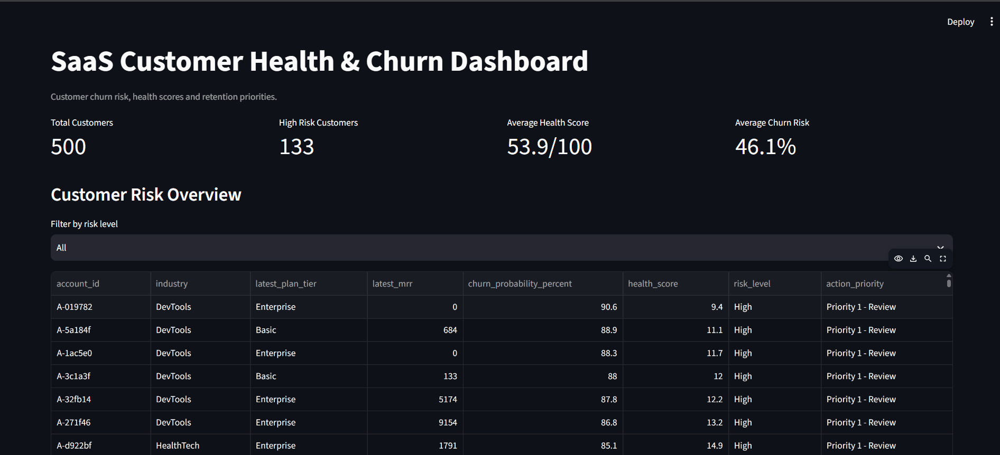
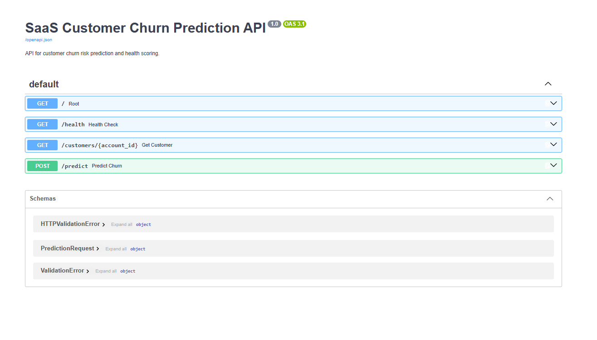

# SaaS Customer Health & Churn Prediction System

An end-to-end machine learning project for predicting customer churn risk in a B2B SaaS environment and translating model outputs into actionable Customer Success insights.

## Project Goal

The goal of this project is to combine account, subscription, product usage and customer support data to:

- identify customers at risk of churn;
- understand behavioural and commercial signals associated with churn;
- generate churn-risk and customer-health scores;
- prioritise accounts for Customer Success intervention;
- expose predictions through a dashboard and API.

The system is designed as a decision-support prototype rather than an automated churn decision system.

## Business Questions

The project explores the following questions:

1. Which customer segments show higher churn rates?
2. Are subscription characteristics or subscription changes associated with churn?
3. Does product usage behaviour differ between retained and churned customers?
4. Are support interactions associated with churn?
5. Can these signals be combined into a useful customer churn-risk score?
6. How can model outputs be converted into actionable retention priorities?

## Project Milestones

| Milestone | Objective | Deliverable |
|---|---|---|
| Data Understanding | Validate source tables, schemas and data quality | Data inspection notebook |
| SQL & EDA | Explore churn across customer, subscription, usage and support behaviour | SQLite analysis and findings |
| Feature Engineering | Create one row per customer for modelling | Customer-level feature dataset |
| Modelling | Compare classification approaches | Logistic Regression, Random Forest and XGBoost |
| Evaluation & Explainability | Evaluate performance and understand model signals | Cross-validation, holdout metrics and feature coefficients |
| Customer Health Layer | Convert predictions into business-facing outputs | Risk scores, health scores, risk tiers and actions |
| Application Layer | Make outputs accessible to users and systems | Streamlit dashboard and FastAPI |
| MLOps & Engineering | Track, package and validate the application | MLflow, Docker, pytest and GitHub Actions CI |

## End-to-End Workflow

Raw SaaS Data  
↓  
Data Validation & Cleaning  
↓  
SQLite / SQL Analysis  
↓  
Customer-Level Feature Engineering  
↓  
Preprocessing Pipeline  
↓  
Model Comparison  
↓  
Balanced Logistic Regression  
↓  
Churn Risk & Health Scoring  
↓  
MLflow Tracking  
↓  
Streamlit Dashboard  
↓  
FastAPI Service  
↓  
Docker + Automated Testing + GitHub Actions

## Key Results

The selected model was a class-balanced Logistic Regression model.

Holdout performance:

- Recall: 59.1%
- F1 Score: 0.419
- ROC-AUC: 0.605

The model showed modest predictive separation, so its outputs are treated as customer-risk prioritisation signals rather than definitive churn predictions.

## Project Demo

### Customer Health Dashboard

The Streamlit dashboard provides Customer Success teams with an overview of customer risk, health scores and retention priorities.



### ML Experiment Tracking

MLflow was used to track and compare Logistic Regression, Balanced Logistic Regression, Random Forest and XGBoost experiments.


### Prediction API

The trained churn model is exposed through a FastAPI service with interactive Swagger documentation.



### Continuous Integration

GitHub Actions automatically installs the test environment and runs the pytest API test suite when code changes are pushed.


## Tech Stack

**Data & Analytics:** Python, Pandas, NumPy, SQL, SQLite, SQLAlchemy  
**Machine Learning:** scikit-learn, XGBoost  
**Experiment Tracking:** MLflow  
**Application:** Streamlit, FastAPI  
**Deployment & Engineering:** Docker, pytest, GitHub Actions, Git/GitHub

## Application Components

### Streamlit Dashboard
Provides a business-facing view of:

- customer churn risk;
- health scores;
- risk categories;
- Customer Success priorities;
- individual customer details.

### FastAPI Service
Provides API endpoints for:

- service health checks;
- customer lookups;
- churn prediction for new customer feature data.

### Docker
Packages the FastAPI prediction service and runtime dependencies into a portable container.

### CI Testing
GitHub Actions automatically runs the pytest test suite when changes are pushed or submitted through pull requests.

## Documentation

Detailed technical documentation is available in the `docs/` directory:

- `data_dictionary.md` — definitions and calculations for raw and engineered features
- `missing_values_strategy.md` — missing-data handling decisions and justification
- `analysis_findings.md` — EDA findings and business interpretation

## Limitations

- The dataset is synthetic and contains some target and behavioural inconsistencies.
- The project uses a static customer snapshot rather than a fully time-aware production prediction window.
- Model performance indicates limited predictive signal.
- Risk scores should therefore support, rather than replace, Customer Success judgement.

## Project Structure

```text
saas-customer-churn-prediction/
│
├── api/
│   └── main.py
│
├── dashboard/
│   └── app.py
│
├── data/
│   ├── raw/
│   └── processed/
│
├── docs/
│   ├── data_dictionary.md
│   ├── missing_values_strategy.md
│   └── analysis_findings.md
│
├── models/
│   └── balanced_logistic_churn_pipeline.joblib
│
├── notebooks/
│   ├── 01_data_inspection.ipynb
│   ├── 02_sql_database_setup.ipynb
│   ├── 03_feature_engineering.ipynb
│   └── 04_model_preprocessing.ipynb
│
├── screenshots/
├── sql/
├── tests/
│   └── test_api.py
│
├── .github/
│   └── workflows/
│       └── ci.yml
│
├── Dockerfile
├── requirements.txt
├── requirements-api.txt
├── requirements-test.txt
└── README.md

## Project Status

Core MVP completed:

- data analysis and feature engineering;
- model comparison and evaluation;
- customer health scoring;
- MLflow experiment tracking;
- Streamlit dashboard;
- FastAPI prediction service;
- Docker containerisation;
- automated API testing;
- GitHub Actions CI.

Further improvements can include stronger feature engineering, model calibration, more robust API validation, monitoring and cloud deployment.